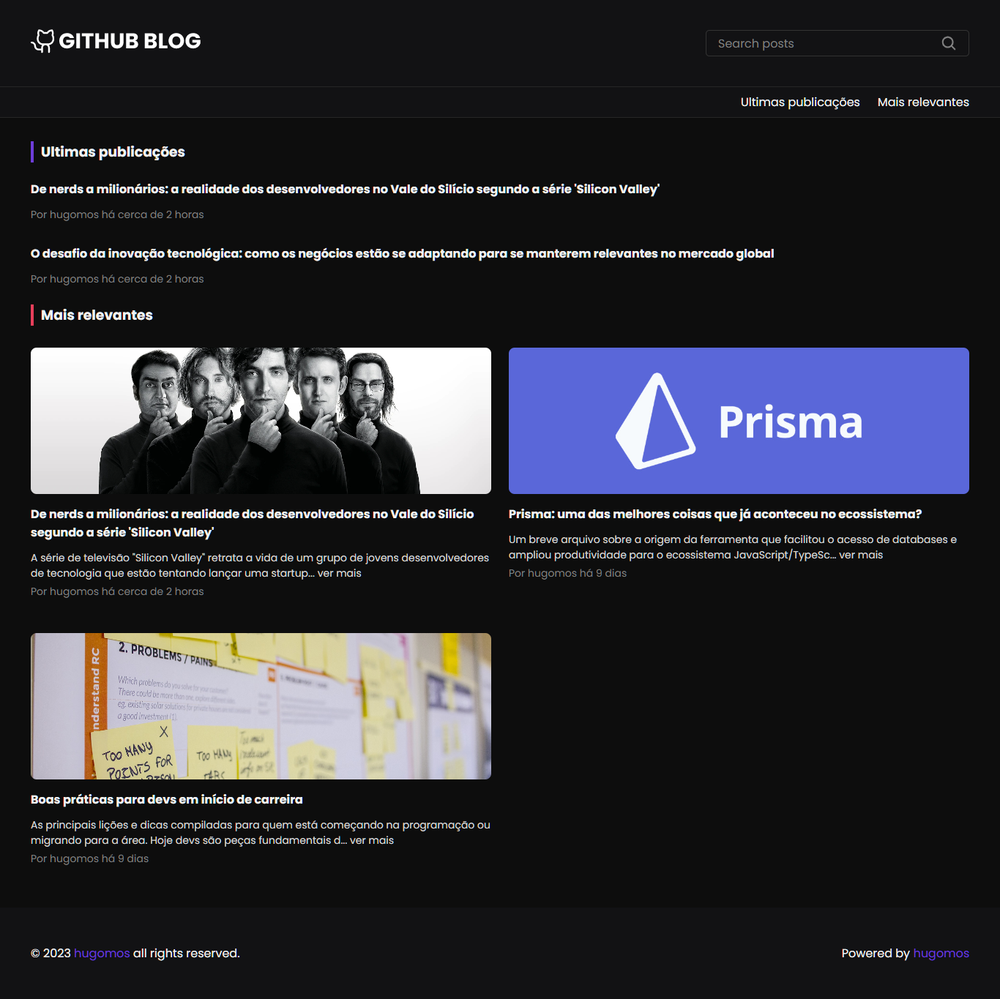
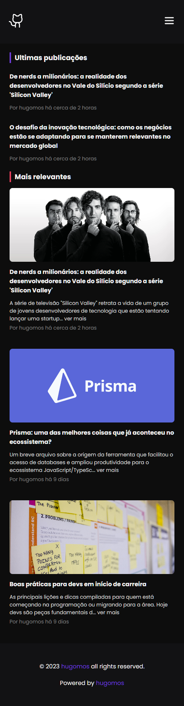
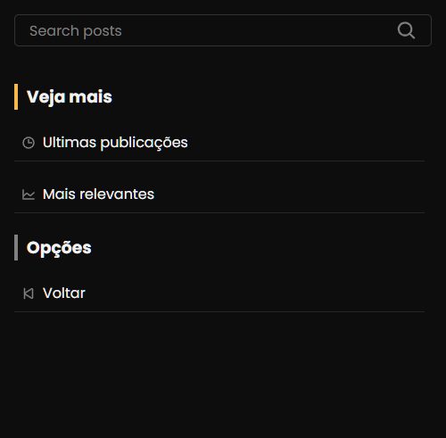

## **Github Blog**

Este projeto de blog foi desenvolvido como uma prova de conhecimento em programação usando TypeScript e Next.js. O objetivo do projeto foi criar uma plataforma de blog moderna, rápida e altamente escalável, que pudesse fornecer uma experiência de usuário excepcional e ao mesmo tempo ser fácil de gerenciar e manter. O funcionamento é baseado em Issues, onde cada issue se torna uma publicação.

A plataforma de blog apresenta uma interface de usuário intuitiva e responsiva, permitindo uma ótima experiência de leitura em diferentes dispositivos.

No geral, este projeto de blog é um exemplo de como o uso de TypeScript e Next.js pode ser benéfico na criação de aplicativos web modernos e altamente escaláveis.

Veja o site neste link: [**Github Blog**](https://githubblog.vercel.app/)

## Funcionalidades

- Criação de publicações baseadas em issues do Github

## Tecnologias Utilizadas

- NextJS
- React
- TypeScript
- Styled-components
- React Hooks
- Axios
- Github API

## Instalação e Execução

1 - Clone este repositório:

```bash
  git clone https://github.com/hugomos/github-blog.git
```

2 - Instale as dependências usando npm ou yarn:

```bash
  yarn install
```

3 - Inicie o servidor usando npm run dev

```bash
  yarn dev
```

## Telas

**Pagina inicial - Desktop**



**Pagina da publicação - Desktop**


**Pagina inicial - Mobile**



**Pagina da publicação - Mobile**


**Mobile Hamburguer Menu**



### Published with [**Vercel**](https://vercel.com/dashboard)
